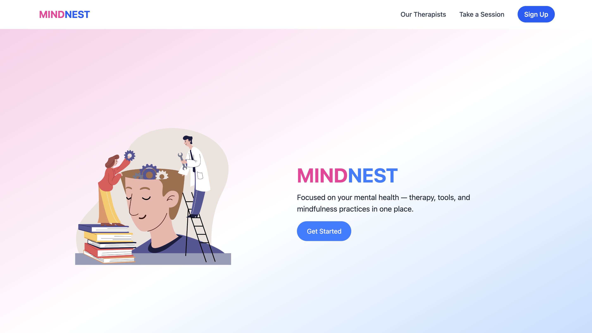
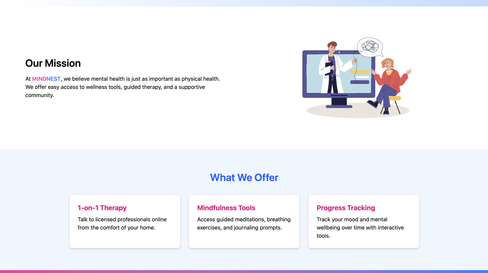
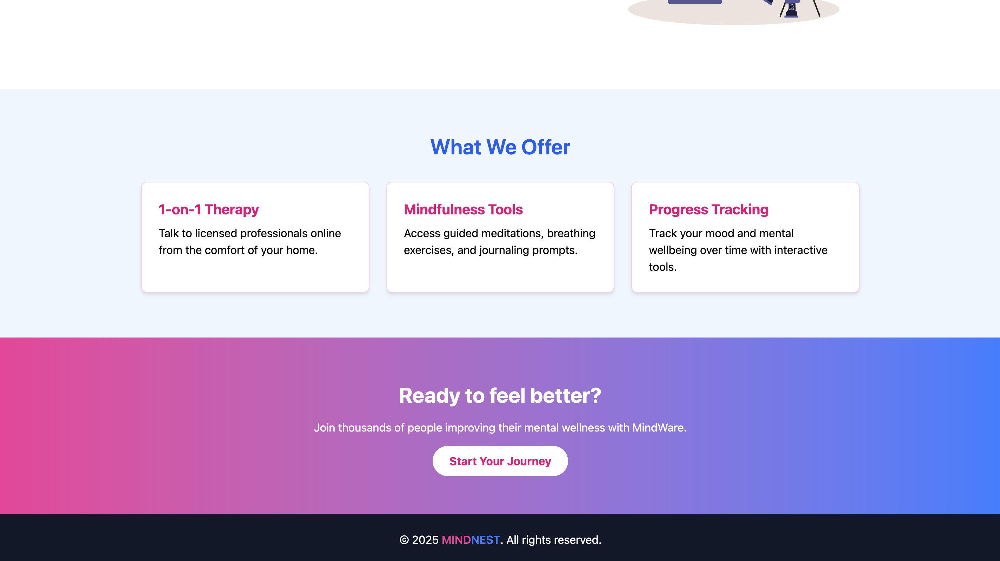
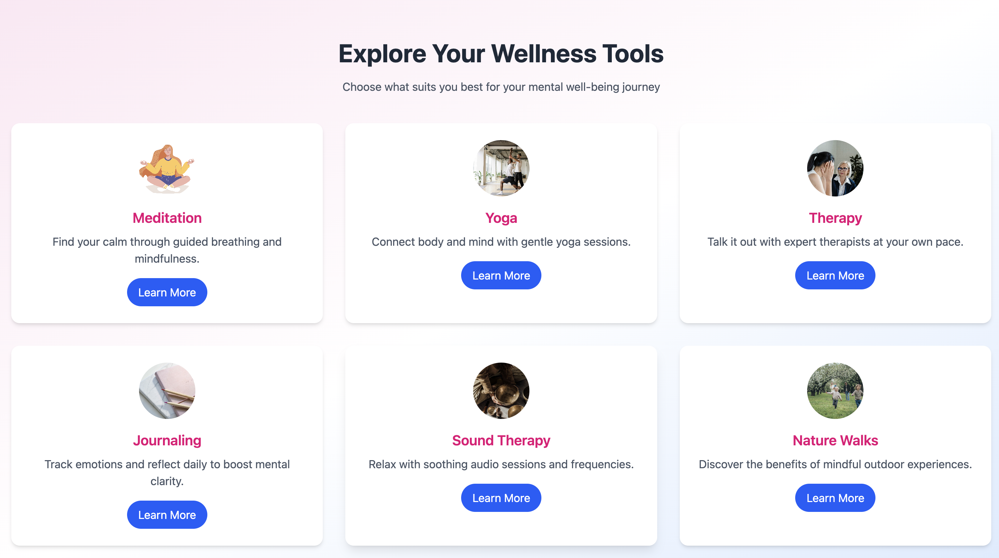
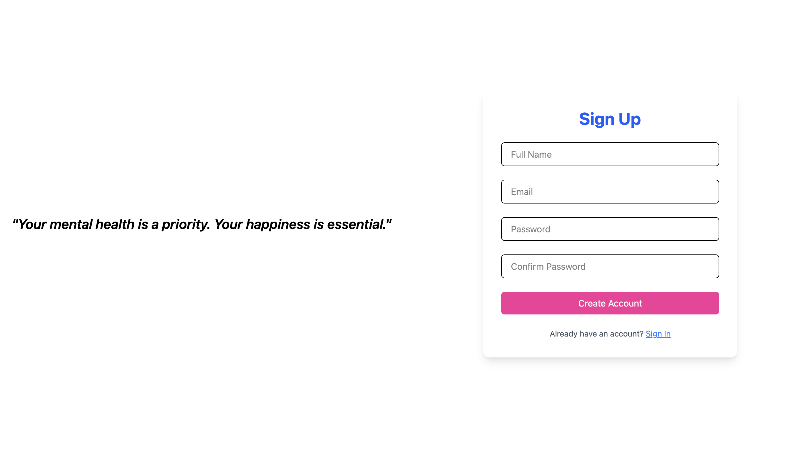
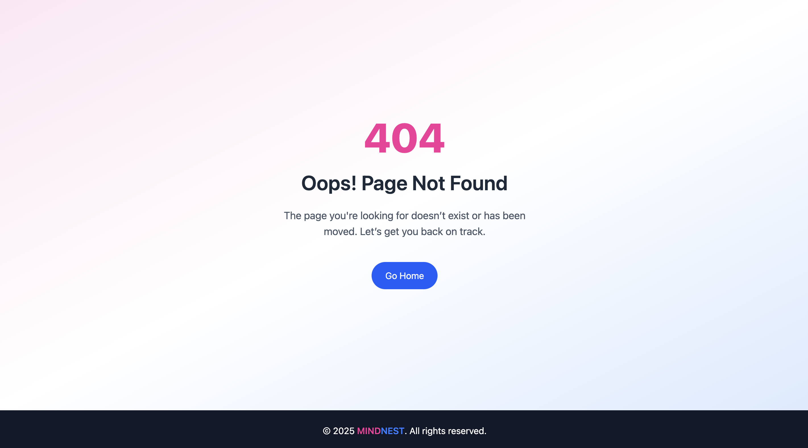

# MindNest Landing Page

A responsive landing page for MindNest, a mental health-focused service, combining a soothing pink-and-blue color theme.  
The page includes sections for features, mental health tools, and a footer.

---

## 📸 Preview

  
 
 
|  
 
 
                                                                                            

---

##  Features

- **Responsive Design** — Works across mobile, tablet, and desktop.
- **Pink & Blue Theme** — “MIND” styled in pink and “NEST” in blue.
- **Features Section** — Highlights key offerings in a 3-column layout.
- **Tools Section** — Displays cards for meditation, yoga, therapy, and more.
- **Footer** — Simple and minimal footer with copyright.

---

##  Tech Stack

- **React** — Frontend framework
- **React Router v7.1.1** — For navigation
- **Tailwind CSS** — Styling and responsive design
- **Static Data** — For images and tool descriptions

---

